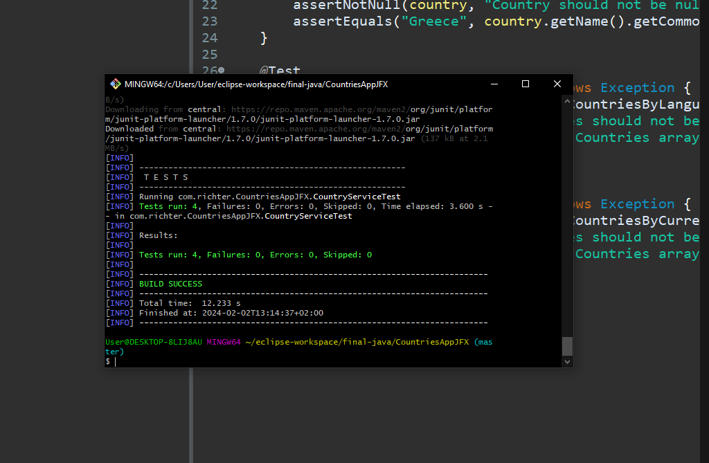

Τελική ατομική άσκηση για το μάθημα java του μεταπτυχιακού προγράμματος 'Προηγμένα Πληροφοριακά Συστήματα'.

still left to finish:

- try -catch exceptions on most properties that might crash
- error messages to the user for certain actions #
- unit tests - working on it 
- null pointer exceptions. 

να προσθεσω auto complete αν ο χρηστης επιλεξει γλωσσες η currency

αυτο σημαινει οτι πρεπει καπως να γίνεται το fetch απο πριν οταν τρεχει η εφαρμογη για να έχει αυτά τα αποτελεσματα.

Considerations:

- αυτη τη στιγμη fetcharo το endpoint για ολα τα στοιχεια ισως καλυτερα αν fetcharo μονο το endpoint
για τα στοιχεια τα οποια με ενδιαφερουν είναι πιο efficient. πως μπορω να δειξω την διαφορα στους 2 τροποους στο runtime

Για την εργασία αυτή χρησιμοποίθηκαν τα εξης εργαλεια:

- Eclipse IDE
- JavaFX maven archetype 0.0.6
- Dependencies:
	Jackson data bind
	Jackson X
	Jackson Y
	Junit for testing 
	
Με βάση τα παραπάνω οι λειτουργίες που αναπτύχθηκαν είναι οι εξής:

1. Μία κλάση POJO /src/main/java/com.richterCCountry.java η δημιουργεί Χ για τα δεδομένα που μας ενδιαφέρουν
2. Μία κλάση CountryService η οποία διαχειρίζεται τα διαφορετικά api calls στα api endpoint του restcountries 
3. Μία κλάση App.java η οποία ξεκινάει το GUI JavaFX

-----

features:

store 5 results
search by name (search field)
search by currency
search by language 

*testing*

